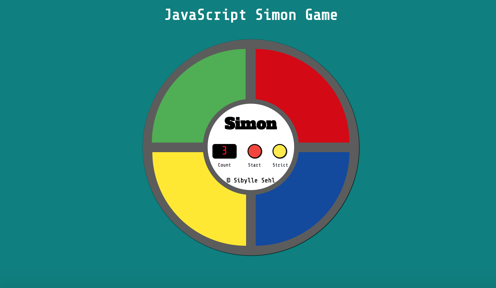

# Simon game

This is a simon game that enables the player to play against "Simon" and repeat a sequence that is given to him/her. Whenever the right sequence is repeated, the difficulty increases by another step.

The game also contains a strict mode, if you want to challenge yourself and reset your score every time you make a mistake. Otherwise, normal mode will be enabled.

The game can be played here:
https://alaskaa.github.io/fcc-simon-game/

